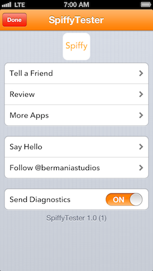

SpiffyKit
=========

A framework for a drop-in view controller that allows users to contact you and share your app.

Screenshots:
---

Dependencies:
---

You'll need iOS 6.0 or higher, and a couple of frameworks, outlined below.

If you try to use it with an earlier SDK, your mileage won't vary, it'll simply blow up. You've been warned.  If you're really stubborn, you may try removing "Tell a Friend" feature. It still won't work.

Getting Started:
---

Once your app's Xcode project knows about Spiffy, it'll be fairly simple to integrate. We have to do five things to see Spiffy in our app:

0. Drag the `SpiffyKit.xproj` and `SpiffyKit` folders into our new app. Don't add anything with "Test" in its name.
1. Add `libSpiffyKit.a` as a build dependency.
2. Link our app against `libSpiffyKit.a`, `Social.framework`, and `MessageUI.framework`
3. Configure SpiffyKit in our App Delegate
4. Show an instance of the `SpiffyViewController`.

Adding Spiffy To Your Project
---
You're probably going to want to add SpiffyKit as a submodule of your existing repo. That, or download the project. Add `SpiffyKit.xproj` and the similarly named `SpiffyKit` directory that's sitting beside the Xcode project. (Don't add the `SpiffyKitTester` or `SpiffyKitTests` directories.)

Adding Spiffy as a Dependency
---
Adding a dependency in Xcode 4 is fairly simple. 

1. Click on your project's root so that you see the configuration in the main area. 
2. Click on *{your app's name}* under "Targets" then on "Build Phases"
3. You should now be staring at a stack of boxes, and the top one will say "Target Dependencies"". If the triangle is pointing at "Target Dependencies" click on the triangle and the box will expand. Click on the itsy bitsy plus in the corner and you should see `libSpiffyKit.a` or `SpiffyKit`. Add it.

Linking Against SpiffyKit
---
1. Beneath the box called "Target Dependencies" is another one that says "Link binary with libraries." Expand it.
2. Click on the plus in the corner and add `SpiffyKit`. Repeat the process for `Social.framework` and `MessageUI.framework`.

Configuring SpiffyKit
---
This is the fun part. SpiffyKit follows the configurator model. There's a singleton class that you call to configure the framework. Then, you can call the same object to tell SpiffyKit to do its thing. 

To configure SpiffyKit, add this method to your app delegate:

    - (void)configureSpiffy {
    	
    	// The numeric ID that iTunes Connect assigns to your app
    	[[SpiffyController sharedController] setAppStoreIdentifier:@""]; 
    	
    	//	A direct URL to your app in iTunes.
		[[SpiffyController sharedController] setAppURL:@""];
		
		//	A link to your website
		[[SpiffyController sharedController] setWebsiteURL:@"http://mosheberman.com"];
		
		//	A link to your App Store developer page
		[[SpiffyController sharedController] setMoreAppsURL:@""]; 
		
		//	Your email address
		[[SpiffyController sharedController] setSupportEmailAddress:@""];
		
		//	Your twitter handle, without the @ symbol
		[[SpiffyController sharedController] setTwitterHandle:@""]; 
		
		//	A color for cell highlights and navbar tint
		[[SpiffyController sharedController] setAppColor:[UIColor orangeColor]]; 
		
	}
	
Now, somewhere in your `applicationDidFinishLaunching...` method, call `[self configureSpiffy]`.

Presenting Spiffy
---

Use this one line of code:

	[[SpiffyController sharedController] presentInViewController:aViewController fromRectWhereApplicable:aCGRect];
	
Spiffy presents itself in a popover on the iPad, and as a modal view controller everywhere else. If you're on an iPad, the second parameter is passed to the popover controller to determine where the "popover is presented from" onscreen. If your on another iOS device, just pass CGRectZero. Alternatively, feel free to amuse yourself. Since your amusement likely isn't applicable, Spiffy will safely ignore you.

Advanced Configuration: Analytics
---

Spiffy doesn't actually manage analytics in your app, but it does provide a UI, for free, for your user to interact with `NSUserDefaults` so you can obtain their permission to use your own analytics library if you wish. (Some well known ones out there are Flurry, Localytics, and TestFlight Live.)

Simply add this line to SpiffyKit to enable the analytics switch:

	[[SpiffyController sharedController] setShouldPresentAnalytics:YES];
	
It's that easy. But how do you actually read out the user's preferences? There is a group of methods in SpiffyController that enables you to do just that:

		#pragma mark - Diagnostics

		- (void)toggleDiagnostics:(UISwitch *)sender;
		- (BOOL)diagnosticsEnabled;

		#pragma mark - Analytics

		- (void)toggleAnalytics:(UISwitch *)sender;
		- (BOOL)analyticsEnabled;

You're probably wondering why I'm passing `UISwitch` objects into my `toggle...:` methods. It's a pretty good question. The answer is that I'm taking a shortcut in my internal UI classes that I can probably refactor. Spiffy manages those values internally, so it's not a good idea to use them. Stick to the getters and you'll be fine.

This functionality uses `NSUserDefaults` as a backing store. The keys are `SpiffyKitDiagnosticsEnabled` and `SpiffyKitAnalyticsEnabled`.

Free Functionality:
---
SpiffyKit shows your app's icon at the top, and a string in format of `{Display Name} {Version} ({Build})` at the bottom. You also get that nifty UI for toggling analytics and diagnostic data in any fan, hate, or love emails that your users may send you.

License
---
Do whatever you want with this code, except sell it or represent it as your own. You may use it in your own apps, even if you sell them for money. Attribution would be nice, but is not required.